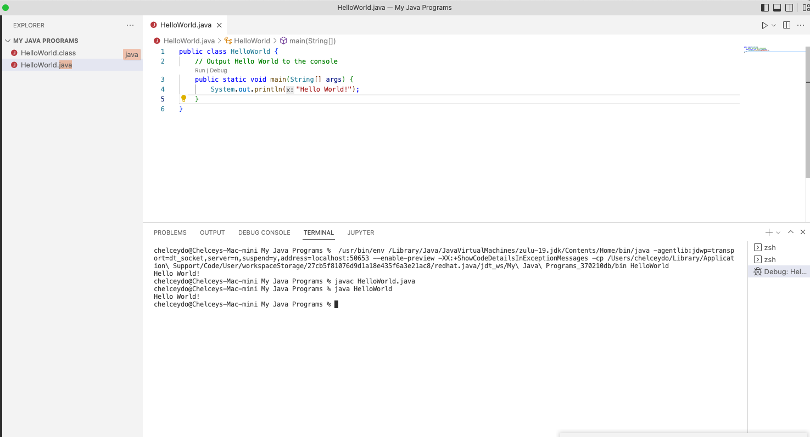

### <span style="color:maroon"> The day on which an important operation is to begin or a change to take effect. </span>

## Goal
- [ ] Go through the Java youtube tutorial in 1 go
- [ ] Labs 4 - 8 
- [ ] Go over the midterm
- [ ] Film the Tiktok video

# <span style="color:purple"> **Java for Beginners**</span>
-- 
# <span style="color:magenta"> **Anatomy of a Java Program**</span>

## <span style="color:purple"> Vocabulary:</span>
<mark >Functions</mark>
 : A block of code that performs a task.
 
 <mark >Class</mark>
 : A container for related functions.
 
 <mark >Methods</mark>
 : A function that is part of a class. 
 
 <mark >Access Modifier</mark>
 : A special keyword that determines if other **classes and methods** in this program can access these **classes and methods**.
 
### How to make a Function in Java
1. Specify ReturnType of that function
```
ReturnType Name() {
   ...
 }
```
---

### Sample Function
- ReturnType of Sample Function is **void**
- Name of Sample Function is **sendEmail()** which identifies purpose of the function
- Inside the parentheses, you add the paremeters for this function, to pass values to the function
- After the paremeter, you add a pair of curly braces
- Inside the curly braces, you write the actual **java** code
- **NOTE**: You **HAVE** to put the left curly brace on the same line you define your function. 
```
void sendEmail() {
   ...
 }
```
---

### Every Java Program should have at least 1 Program
### That is (MAIN)
- Main is the entry point to our programs
```
void main() {
   ...
}
```
---
### Class that contains the Main Function
1. Start with the keyword `class`
2. Then we give the proper descriptive name `Main`
3. Add pair of curly braces
4. Functions will be defined in between those curly braces, those functions belong to this class
```
class Main {
   void main() {
      ...
   }
}
```

### Class with Access Modifier (Anatomy of Java Program)
```
public class Main {
   public void main() {
      ...
   }
}
```

### <span style="color:azure"> Notes:</span>
- <span style="color:blue"> **Functions** are the smallest building blocks of the Java program.</span>
- <span style="color:blue"> **Functions** don't belong on their own, they should always belong to a **Class**.</span>
- <span style="color:blue"> **Classes** help organize our code, like how fruits, veggies, and sweets have their own designated areas in the Grocery stores. **Classes in Java, in the same way, contain related **functions**</span>
- <span style="color:blue"> Every **java program** must contain **one class** that contains the **main function**. </span>
- <span style="color:blue"> The more accurate term for **functions** is **method**.</span>
- <span style="color:blue"> If a **function** is *outside a class* it is referred to as a **function**, but if the **function** is *inside a class* it is referred to as a **method of that class**.</span>
- <span style="color:blue"> In **java** all those **classes and methods** should have an **access modifier**.</span>
- <span style="color:blue"> We usually put the **access modifier** in front of our **class and method declarations**. The 4 **access modifiers** in **Java** are: </span>
  1. public
  2. protected
  3. private
  4. default
- <span style="color:blue"> Naming **Classes** in **java** follows the *Pascal Naming Convention*, which means **the first letter of every word should be uppercase**. </span>
- <span style="color:blue"> Naming **Methods** in **java** follows the *camel Naming Convention*, which means **that the first letter of every word should be uppercase, *except* the first word**. </span>
---

# <span style="color:magenta"> **Your First Java Program**</span>

### How to Write & Execute first Java Program:


- [ ] <span style="color:magenta"> **Cheat Sheet**</span>

- [ ] <span style="color:magenta"> **How Java Code Gets Executed**</span>

- [ ] <span style="color:magenta"> **Course Structure**</span>

- [ ] <span style="color:magenta"> **Types**</span>

- [ ] <span style="color:magenta"> **Variables**</span>

- [ ] <span style="color:magenta"> **Primitive Types**</span>

- [ ] <span style="color:magenta"> **Reference Types**</span>

- [ ] <span style="color:magenta"> **Primitive Types vs. Reference Types**</span>

- [ ] <span style="color:magenta"> **Strings**</span>

- [ ] <span style="color:magenta"> **Escape Sequences**</span>

- [ ] <span style="color:magenta"> **Arrays**</span>

- [ ] <span style="color:magenta"> **Multi-Dimensional Arrays**</span>

- [ ] <span style="color:magenta"> **Constants**</span>

- [ ] <span style="color:magenta"> **Arithmetic Expressions**</span>

- [ ] <span style="color:magenta"> **Order of Operations**</span>

- [ ] <span style="color:magenta"> **Casting**</span>

- [ ] <span style="color:magenta"> **The Math Class**</span>

- [ ] <span style="color:magenta"> **Formatting Numbers**</span>

- [ ] <span style="color:magenta"> **Reading Input**</span>

- [ ] <span style="color:magenta"> **Project Mortgage Calculator**</span>

- [ ] <span style="color:magenta"> **Control Flow**</span>

- [ ] <span style="color:magenta"> **Comparison Operators**</span>

- [ ] <span style="color:magenta"> **Logical Operators**</span>

- [ ] <span style="color:magenta"> **If Statements**</span>

- [ ] <span style="color:magenta"> **Simplifying If Statements**</span>

- [ ] <span style="color:magenta"> **The Ternary Operator**</span>

- [ ] <span style="color:magenta"> **Switch Statements**</span>

- [ ] <span style="color:magenta"> **Exercise: FizzBuzz**</span>

- [ ] <span style="color:magenta"> **For Loops**</span>

- [ ] <span style="color:magenta"> **While Loops**</span>

- [ ] <span style="color:magenta"> **Do...While Loops**</span>

- [ ] <span style="color:magenta"> **Break and Continue**</span>

- [ ] <span style="color:magenta"> **For-Each Loop**</span>

- [ ] <span style="color:magenta"> **Back to Project: Mortgage Calculator**</span>

- [ ] <span style="color:magenta"> **Control Flow Summary**</span>

- [ ] <span style="color:magenta"> **Clean Coding**</span>


## What is the main point of the Big O Notation?
> <span style="color:blue"> Describe the asymptotic behavior of functions (which is how fast the f(x) grows/declines)</span>

## What is asymptotic behavior? 
> <span style="color:blue"> method of describing limiting behavior</span>

## What is limiting behavior?
> <span style="color:blue"> limit is value that f(x) approaches as input approaches some value</span>
> <span style="color:blue"> The limit of f(x), as x approaches a, is equal to L.</span>
> <span style="color:blue"> means: As x gets closer to a, f(x) gets closer to L.</span>

## Why do we need to use Big O for?
> <span style="color:blue"> used to classify algorithms according to run time or space requirements</span>

## Why do we need to classify algorithms according to run time or space requirements?
> <span style="color:blue"> Knowing how the algorithm works efficiently can add value to the way we do programming</span>
> <span style="color:blue"> Can make the program behave in required optimal conditions</span>

## What does optimal conditions means? 
> <span style="color:blue"> best level or state that it could achieve</span>

https://www.freecodecamp.org/news/all-you-need-to-know-about-big-o-notation-to-crack-your-next-coding-interview-9d575e7eec4/

### [Back to Contents:](https://chelcey.github.io/cse11-self-study/)
