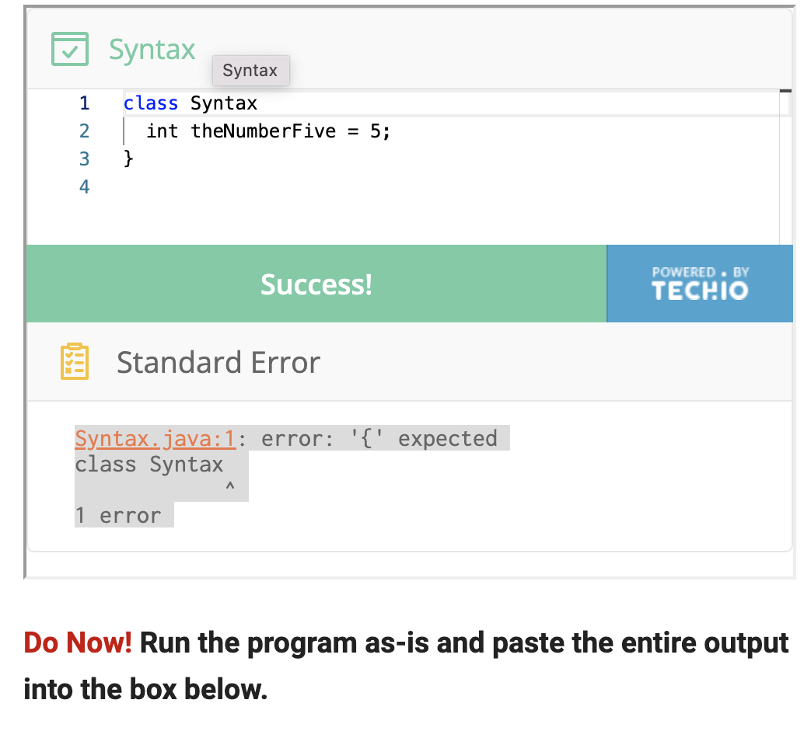

# <span style="color:purple"> **(MORE) FIELDS**</span>

## What is the main point of (More) Fields?
> <span style="color:blue"> Fields are a variable, that describes the type of information being stored. </span>

### Reading
- [x] 1.1 Programs, Fields
- [x] 1.2 Java as a Calculator
- [x] 1.3 Syntax
- [x] 2.1 Using Fields
- [ ] 2.2 Beyond ints
- [ ] 2.3 Java Checks Types

### Videos
- [ ] Intro to Runnning Programs
- [ ] Syntax Errors
- [ ] Arithmetic
- [ ] Field Access

---

# <span style="color:magenta"> 1.1 Programs, Fields</span>

## To write, tests, and run programs in a language called Java: 
> <span style="color:blue"> We will put a bunch of text into file with the extension `.java`</span>

---
## Given this program:
  ```
  class FirstExample
  {
    int theNumberFive = 5; 
    }
 ```
 
 ---
 
 ## Output:
 
 ```
 Tester Prima v.2.3
-----------------------------------
Tests defined in the class: FirstExample:
---------------------------
FirstExample:
---------------
new FirstExample:1(
 this.theNumberFive = 5)
---------------
No test methods found.
```

### Dissecting the program:
- <span stye="color:red"> FirstExample</span> <span style="color:green"> is the Test defined in the class</span>
- <span stye="color:red"> *The first line*</span> <span style="color:dark green"> is telling us the name of the tool we are using</span>
- <span stye="color:red"> *This output*</span> <span style="color:dark green"> is saying that an **object** was created and it **class** was `FirstExample`</span>
- <span stye="color:red"> *The number after the `:`*</span> <span style="color:dark green"> is a unique identifier for this objecgt which we call its **reference**(no special meaning, jusgt unique to this object)</span>
- <span stye="color:red"> **Reference**</span> <span style="color:dark green"> has a single **field** which we can refer with `this.theNumberFive`, whose value is `5`</span>

| Vocabulary | Description|
| ----------- | ----------- |
| **object** | new FirstExample:1(this.theNumberFive = 5)|
| **reference** | :1 |
| **field value** | 5 |
| **field name** | theNumberFive |
| **class name** | FirstExample |

---

# <span style="color:magenta"> 1.2 Java as a Calculator</span>

## Given this program:
  ```
  class Operators {
  int theAnswer = 5 + (2 * 45);
}
 ```
 
 ---
 
 ## Output:
 
 ```
Tester Prima v.2.3
-----------------------------------
Tests defined in the class: Operators:
---------------------------
Operators:
---------------
new Operators:1(
 this.theAnswer = 95)
---------------
No test methods found.
```

### Dissecting the program:
- <span stye="color:red"> **To calculate the value 95 for field `theAnswer`**</span> <span style="color:dark green"> this code used multiplication (with the `*` operator) and addition (with the `+` operator)</span>
- <span style="color:dark orange">Java correctly processes the order of operations according to the multiplication-before-addition rule. </span>
- <span style="color:dark orange"> Only the resulting value is stored in the field and shown in the output, not the whole program or calculation.</span>
- <span style="color:dark orange"> We can insert parentheses around the part we want to evaluate first </span>

- <span stye="color:red"> *The first line*</span> <span style="color:dark green"> is telling us the name of the tool we are using</span>

> <span style="color:blue"> limit is value that f(x) approaches as input approaches some value</span>
> <span style="color:blue"> The limit of f(x), as x approaches a, is equal to L.</span>
> <span style="color:blue"> means: As x gets closer to a, f(x) gets closer to L.</span>

## Given this program [Operators]
```
class Operators {
  int theAnswer = (5 + 2) * 45;
  int anotherAnswer1 = (5 + 2) - 3 * 9;
  int anotherAnswer2 = ((5+2) -3) * 9;
}
```
---

## Output
```
Tester Prima v.2.3
-----------------------------------
Tests defined in the class: Operators:
---------------------------
Operators:
---------------
new Operators:1(
 this.theAnswer = 315
 this.anotherAnswer1 = -20
 this.anotherAnswer2 = 36)
---------------
No test methods found.
```

### Dissecting the program:
- <span style="color:dark orange"> The programs would still perform the caclulation and output the results just fine even if we picked other field names like `x` or `someReallyLongFieldName` </span>

---
## Not Quite Math Program

```
class NotQuiteMath {
  int theAnswer2 = (5 + 4) / 2;
}
```
---
## Output

```
Tester Prima v.2.3
-----------------------------------
Tests defined in the class: NotQuiteMath:
---------------------------
NotQuiteMath:
---------------
new NotQuiteMath:1(
 this.theAnswer2 = 4)
---------------
No test methods found.
```
---

### Dissecting the program:
- <span style="color:orange"> When dividing `int` values, Java simply *removes* decimal part so that the answer is always an integer. It simply truncates any decimal portion of the number entirely (even if it would be 0.9999) </span>

---

## Negative Results Program 1
```
class NegativeResults {
    int negativeResult = 1 + (-3);
}
```
---
## Output
```
Tester Prima v.2.3
-----------------------------------
Tests defined in the class: NegativeResults:
---------------------------
NegativeResults:
---------------
new NegativeResults:1(
 this.negativeResult = -2)
---------------
No test methods found.
```
---

## Negative Results Program 2
```
class NegativeResults {
    int negativeResult1 = 5/(-3);
    int negativeResult2 = 6/(-3);
}
```
---
## Output
```
Tester Prima v.2.3
-----------------------------------
Tests defined in the class: NegativeResults:
---------------------------
NegativeResults:
---------------
new NegativeResults:1(
 this.negativeResult1 = -1
 this.negativeResult2 = -2)
---------------
No test methods found.
```
---
### Dissecting the program:
- <span style="color:orange red"> Java will simply remove the fractional part for negative `int`s as well </span>

---
# <span style="color:magenta"> 1.3 Syntax</span>

<mark >keyword</mark>
 : have a specific meaning in java
 
 **Examples of keyword:**
 1. `class`
 2. `int`

<mark >syntax</mark>
 : specific order for all these words and symbols in valid program. 
 
  **Syntax Order:**
 1. There must be a name after the keyword `class`
 2. Name must be followed by open curly brace (`{`)
 3. Inside must be a sequence of fields, each separated by a semicolon
 4. Then comes a closing curly brace (`}`)
 5. Allowed any amount of **whitespace** between fields or around the curly braces (spaces, newlines, and tabs)

<mark >whitespace</mark>
 : spaces, newlines, and tabs
 
---
## <span style="color:red"> For some reason, I am not sure what I am doing wrong? </span>


---

# <span style="color:magenta"> 2.1 Using Fields</span>

<mark >tester</mark>
 : library along with Java that would store fields' values and then output them when the program was run. 

## Acceleration on Mars program
```
class UsingFields {
  int distAfter2sec = (4 / 2) * (2 * 2);
  int distAfter4sec = (4 / 2) * (4 * 4);
  int distAfter6sec = (4 / 2) * (6 * 6);
}
```
---
## Output
```
Tester Prima v.2.3
-----------------------------------
Tests defined in the class: UsingFields:
---------------------------
UsingFields:
---------------
new UsingFields:1(
 this.distAfter2sec = 8
 this.distAfter4sec = 32
 this.distAfter6sec = 72)
---------------
No test methods found.
```
---
- <span style="color:blue"> **To store a common value used in many places:** </span>
  <span style="color:brown"> We could define a field that is just for storing the gravity constant </span>
  
---
## Using Fields Programs
```
class UsingFields {
  int gravity = 10;
  int distAfter2sec = (this.gravity / 2) * (2 * 2);
  int distAfter4sec = (this.gravity / 2) * (4 * 4);
  int distAfter6sec = (this.gravity / 2) * (6 * 6);
}
```
---
## Output:
```
Tester Prima v.2.3
-----------------------------------
Tests defined in the class: UsingFields:
---------------------------
UsingFields:
---------------
new UsingFields:1(
 this.gravity = 10
 this.distAfter2sec = 20
 this.distAfter4sec = 80
 this.distAfter6sec = 180)
---------------
No test methods found.
```
---
### Dissecting the program:
- USE: <span stye="color:red"> **field access**</span> <span style="color:green"> instead of repeating `10` over and over</span>

## Field Access Shown:
- <span style="color:burgundy"> `this.gravity`, to look up the value in the `gravity` field.</span>
- <span style="color:red"> Instead of writing the gravity [i.e. in this case, 4] over and over, the program creates a `int gravity = 4` so they save time not having to write 4 over and over again.</span>

---
## Getting Paid Program
```
class Pay {
  int hourlyRate = 20;
  int numHours = 15;
  int pay = this.hourlyRate * this.numHours;
}
```
---

## Output
```
Tester Prima v.2.3
-----------------------------------
Tests defined in the class: Pay:
---------------------------
Pay:
---------------
new Pay:1(
 this.hourlyRate = 20
 this.numHours = 15
 this.pay = 300)
---------------
No test methods found.
```
---
## Calculating Revenue Program
```
class Revenue {
  int costPerItem = 5;
  int numSoldPerWeek = 20;
  int revenuePerWeek = this.costPerItem * this.numSoldPerWeek;
  int weeks = 10;
  int totalRevenue = this.revenuePerWeek * this.weeks;
}
```
---
## Output
```
Tester Prima v.2.3
-----------------------------------
Tests defined in the class: Revenue:
---------------------------
Revenue:
---------------
new Revenue:1(
 this.costPerItem = 5
 this.numSoldPerWeek = 20
 this.revenuePerWeek = 100
 this.weeks = 10
 this.totalRevenue = 1000)
---------------
No test methods found.
```
---

# <span style="color:magenta"> 2.2 Beyond ints</span>

<mark >String</mark>
 : sequence of characters, that can represent a variety of info ranging from people names,addresses, passwords, usernames, web addresses, content of a paragraph like this one, etc.
 
 ## To Create a `String` in Java
 - <span style="color:blue"> Put a sequence of characters in between quotation marks</span>
 - <span style="color:blue"> Can be stored in fields, just as `int`s can</span>
  
 ## Example String
 ```
 class StringExamples {
  String name = "Dorothy Vaughan";
  String password = "s00peR_C_kret";
  String sentence = "But Java, and programming languages in general, support many other kinds of data.";
}
```
---
## Note
- <span style="color:red"> `String` starts with **capital** `S`, but `int` starts with **lowercase** `i`</span>

---
## String Example Program
```
class StringExamples {
  String name = "Dorothy Vaughan";
  String password = "s00peR_C_kret";
  String sentence = "But Java, and programming languages in general, support many other kinds of data.";
}
```
---
## Output
```
Tester Prima v.2.3
-----------------------------------
Tests defined in the class: StringExamples:
---------------------------
StringExamples:
---------------
new StringExamples:1(
 this.name = "Dorothy Vaughan"
 this.password = "s00peR_C_kret"
 this.sentence = "But Java, and programming languages in general, support many other kinds of data.")
---------------
No test methods found.
```
---

### <span style="color:violet"> Note: </span>
- **You must get used to reading and responding to error messages like the one from the previous step. It’s nearly impossible to write correct syntax on the first try all the time**
- **Order of words and symbols is important**
- **Respond well to error messages** *Don't be intimidated by them, but leverage them to figure your mistakes and typos*

## Why do we need to use (More) Fields for?
> <span style="color:indigo"> To specify the type(s) of information being stored in the class. </span>


### [Back to Contents:](https://chelcey.github.io/cse11-self-study/)
